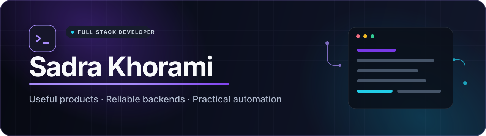

  

  
  
  
  

## Hey, I'm Sadra.

I'm a full-stack developer who likes building practical software: web products, APIs, bots, and small automations that solve a clear problem.

Most of my recent work is in **TypeScript and Next.js** or **PHP and Laravel**. I care about clean interfaces, predictable backend behavior, and software that is easy to run and maintain.

## Selected work

<table>
  <tr>
    <td width="50%" valign="top">
      <h3>Veyra</h3>
      
A responsive product site for a social media management platform, with custom branding, animated sections, pricing, and authentication screens.

      
<code>Next.js</code> <code>TypeScript</code> <code>Tailwind CSS</code> <code>Framer Motion</code>

      
<a href="https://veyra-ai-wheat.vercel.app">Live demo</a> · <a href="https://github.com/SadraKhorami/veyra-ai">Source code</a>

    </td>
    <td width="50%" valign="top">
      <h3>Contact Studio</h3>
      
An offline-first Persian desktop contact manager with groups, analytics, CSV and PDF tools, portable backups, and an interactive referral graph.

      
<code>Tauri</code> <code>React</code> <code>TypeScript</code> <code>Rust</code>

      
<a href="https://github.com/SadraKhorami/contact-studio">View repository</a>

    </td>
  </tr>
  <tr>
    <td width="50%" valign="top">
      <h3>TeleCast API</h3>
      
A REST API for Telegram bots and campaigns, with queued delivery, scheduling, idempotency, Redis locks, webhooks, and OpenAPI documentation.

      
<code>Laravel</code> <code>PostgreSQL</code> <code>Redis</code> <code>Docker</code>

      
<a href="https://github.com/SadraKhorami/telecast-api">View repository</a>

    </td>
    <td width="50%" valign="top">
      <h3>FXPulse</h3>
      
A Discord bot for live FX and commodity snapshots, watchlists, interactive controls, and voice-channel tickers backed by MongoDB.

      
<code>Node.js</code> <code>discord.js</code> <code>MongoDB</code>

      
<a href="https://github.com/SadraKhorami/fxpulse">View repository</a>

    </td>
  </tr>
</table>

## Tools I use

  

## Say hello

If you want to talk about a product, an API, or an automation idea, the quickest ways to reach me are [Telegram](https://t.me/amo_sadra) and [LinkedIn](https://www.linkedin.com/in/khoramii/).

You can find the rest of my work at [khorami.dev](https://khorami.dev) and [github.com/SadraKhorami](https://github.com/SadraKhorami).
